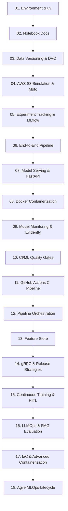

# MLOps Depth Tutorials

Welcome to the **MLOps Depth Tutorials** repository. This is a hands-on learning sandbox designed to teach key production Machine Learning Operations concepts step-by-step.

Instead of writing standard markdown documentation or clicking through heavy Jupyter Notebooks, all tutorials in this project are written as **fully executable, highly-celled Python (`.py`) scripts**. They are structured using the `# %%` percent format, allowing you to run them cell-by-cell in your favorite IDE (VS Code, PyCharm, etc.), while compiling into beautiful notebooks on this website.

---

## 🧭 Roadmap & Modules

Our curriculum spans the full lifecycle of production machine learning:



### 📦 1. Core Engineering & Infrastructure
*   **01. Environment Management (`uv`):** Learn lightning-fast package installation, virtual environments, and lockfiles.
*   **02. Notebook Documentation (Jupytext):** Understand how `# %%` Python scripts compile into documentation pages.
*   **03. Data Versioning (`dvc`):** Version massive datasets outside of Git, pushing and pulling metadata.
*   **04. AWS S3 Simulation (`moto`):** Interact with S3 buckets locally using simulated cloud infrastructure.

### 🧪 2. Machine Learning Lifecycle
*   **05. Experiment Tracking (`mlflow`):** Track parameters, metrics, performance logs, and manage a central Model Registry.
*   **06. Integrated Pipeline:** Chain DVC pipelines (`dvc.yaml`) and MLflow to create a fully tracked model training job.

### 🚀 3. Deployment & Observability
*   **07. Model Serving (`fastapi`):** Deploy python models behind clean REST APIs.
*   **08. Docker Containerization:** Write a secure `Dockerfile` to package python environments and models.
*   **09. Drift & Monitoring (`evidently`):** Inspect feature shifts, performance degradation, and data health profiles.
*   **10. CI/ML Quality Gates:** Programmatically verify newly trained model performance before deployment.
*   **11. GitHub Actions CI Pipeline:** Orchestrate syntax validation, data generation, pipeline execution, pytest runs, and automated container builds.

### 🧠 4. Advanced MLOps & Specialized Paradigms (Upcoming)
*   **12. Pipeline Orchestration & DAGs (Airflow / Prefect):** Define complex multi-stage DAGs, retry rules, and scheduling.
*   **13. Feature Store Implementation (Feast):** Synchronize offline and online stores, preventing leakage and training-serving skew.
*   **14. gRPC Serving & Release Strategies:** Server optimization (REST vs. gRPC) and canary/shadow deployments.
*   **15. Continuous Training & HITL:** Trigger automated retraining based on statistical drift, with Human-in-the-loop fallback.
*   **16. LLMOps & Generative AI:** Version prompts, run RAG evaluations, and manage API cost and latency constraints.
*   **17. IaC & Advanced Containerization:** Deploy declarative ML infrastructure and compile GPU-optimized containers.
*   **18. Agile MLOps Lifecycle:** Feasibility checkpoints, baseline heuristics, and handling ML-sprint velocity mismatch.

---

## 🛠️ Quick Start

To begin running the code locally on WSL/Linux:

1. **Verify `uv` installation:**
   ```bash
   uv --version
   ```
2. **Synchronize dependencies:**
   ```bash
   uv sync
   ```
3. **Execute any tutorial module:**
   ```bash
   uv run python src/module_01_environment_uv/uv_guide.py
   ```
